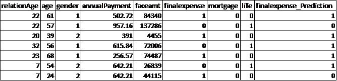
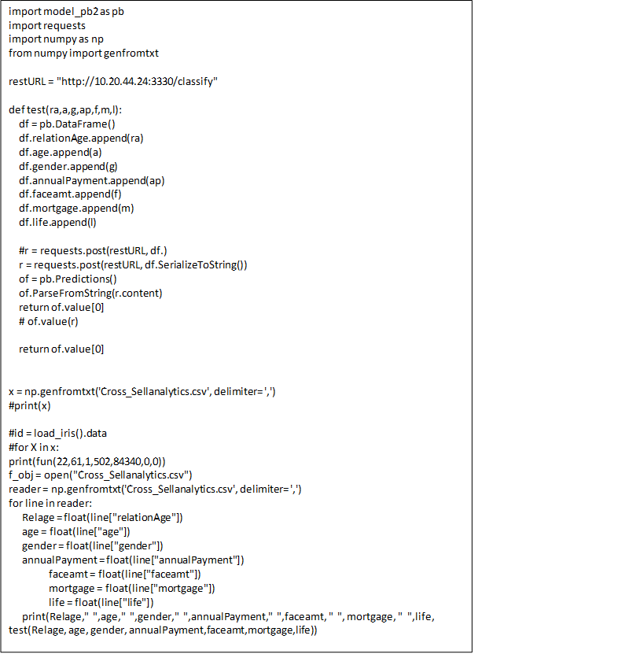

.. ===============LICENSE_START=======================================================
.. Acumos CC-BY-4.0
.. ===================================================================================
.. Copyright (C) 2017-2018 AT&T Intellectual Property & Tech Mahindra. All rights reserved.
.. ===================================================================================
.. This Acumos documentation file is distributed by AT&T and Tech Mahindra
.. under the Creative Commons Attribution 4.0 International License (the "License");
.. you may not use this file except in compliance with the License.
.. You may obtain a copy of the License at
..
.. http://creativecommons.org/licenses/by/4.0
..
.. This file is distributed on an "AS IS" BASIS,
.. WITHOUT WARRANTIES OR CONDITIONS OF ANY KIND, either express or implied.
.. See the License for the specific language governing permissions and
.. limitations under the License.
.. ===============LICENSE_END=========================================================

====================
Cross-Sell Analytics
====================

**Identify next sellable product to increase the average revenue**

Table of Contents
=================

`Customer: US Financial Life and Annuity Insurance Company <#customer-us-financial-life-and-annuity-insurance-company>`__

`Business Problem: <#business-problem>`__

`Business Requirement: <#business-requirement>`__

`Benefits: <#benefits>`__

`DATA used for the study: <#data-used-for-the-study>`__

`Data Fields Considered for the analysis with description: <#data-fields-considered-for-the-analysis-with-description>`__

`Outcome: <#outcome>`__

`Onboard the model, deploy and run the model <#onboard-the-model-deploy-and-run-the-model>`__

**Customer**: US Financial Life and Annuity Insurance Company
-------------------------------------------------------------

**Business Problem:**
---------------------

-  Predict who can be potential buyers for the "Final Expense"
   product from the existing customers who have not purchased it yet

**Business Requirement:**
-------------------------

-  Build sales association model

-  Identify next sellable products

-  Understand key data attributes to increase average revenue per
   customer using cross-sell analytics.

**Benefits:**
-------------

-  Selling an additional product or service to an existing customer is
   adding different additional coverages or including special coverages
   like Accidental Death Benefits, Pension Term Benefits, Senior or Pre
   need Benefits, etc., in case of an insurance service/product.

-  The probability of selling to an existing customer is more beneficial
   when compared to selling to a new prospect.

**DATA used for the study:**
----------------------------

Sample data has 1500 records and 9 fields.

The sample data is shown below:

|image0|

**Data Fields Considered for the analysis with description:**
-------------------------------------------------------------

-  Relation Age - tenure/years customer associated with Insurance
   Company

-  Age - Customer Age

-  Gender - Customer gender(Male/Female)

-  AnnulPayment - Yearly premium amount

-  Faceamt - Total insured value

-  Mortgage - Product (1 - Customer already purchased, 0 - Customer not
   purchased)

-  Life - Product (1 - Customer already purchased, 0 - Customer not
   purchased)

-  Final expense - Product (1 - Customer already purchased, 0 - Customer
   not purchased)

**Machine Learning Algorithm Used: Logistic Regression**

-  Sample dataset is processed, Missing values are imputed with the
   previous value in the field.

-  Logistic Regression algorithm is trained on the entire dataset and
   tested on the same dataset.

**Outcome: **
-------------

-  Accuracy, precision and recall of the prediction are 65%, 43%and 65%
   respectively.

|image1|

Target Variable = finalexpense

Independent variables = relationage, age, gender, annulpayment, faceamt,
finalexpense, mortgage, life

Output = finalexpense_Predition (0: means not potential customer for
selling "Final Expense" product and 1: means Potential cutomer for
selling Final Expense product)

**Definitions:**

-  **Accuracy**\ =Correctly Predicted out of Total Predicted.

-  **Sensitivity** = true positive rate or the proportion of positives
   that are correctly identified (Positive predicted / Total actual
   positive)

**Onboard the model, deploy and run the model**
-----------------------------------------------

Steps to test the output for a model are -

Login to Acumos, Search for Model, deploy to cloud and run the script.

|image2|

The detailed document for onboarding, downloading and running the models is available on the Acumos wiki page @  https://wiki.acumos.org/display/AC/Soup-to-Nuts+Example:+Onboarding,+Downloading,+Deploying,+and+Using+a+Model+in+Acumos

**The deployed model can be run using below command -**

**1. docker load  -i <Model docker image>**

e.g. - docker load  -i  ~/Downloads/3330:3330 "your-server"-nexus01:8001/Cross_Sell_1_5_18_592f2cd4-9dbb-4a.tar

**2.     Docker run -p <external available port>:3330 <Model Docker imageI>**

e.g. - Docker run -p 3330:3330 "your-server"-nexus01:8001/Cross_sell_1_5_18_592f2cd4-9dbb-4a

**3.      Generate Model_pb2 script**

 This description file needs to be compiled into native code for your particular language (Python, in our case). We simply invoke the Protobuf compiler, instructing it to produce Python code in the current directory and need to rename python produced file name to model_pb2

$ protoc model.proto --python_out=.

The model microservice would be listening on the mentioned port. User
can use below script to invoke the model. The sample test data is
included below or user can try with different data in same format. User
should replace the restURL as per the deployment of the model.

**The script to execute the model is below.**

Script:

|image3|

Note - model_pb2 as imported in script is compiled output of the model
proto file as mentioned in the wiki link mentioned above. This file
should be available along with the script file.

Sample Test data -

+-------------+-----+--------+---------------+---------+----------+------+
| relationAge | age | gender | annualPayment | faceamt | mortgage | life |
+=============+=====+========+===============+=========+==========+======+
| 22          | 61  | 1      | 502.72        | 84340   | 0        | 0    |
+-------------+-----+--------+---------------+---------+----------+------+
| 22          | 57  | 1      | 957.16        | 137286  | 0        | 1    |
+-------------+-----+--------+---------------+---------+----------+------+
| 20          | 39  | 2      | 391           | 4455    | 0        | 0    |
+-------------+-----+--------+---------------+---------+----------+------+
| 32          | 56  | 1      | 615.84        | 72006   | 0        | 1    |
+-------------+-----+--------+---------------+---------+----------+------+
| 23          | 68  | 1      | 256.57        | 74487   | 0        | 0    |
+-------------+-----+--------+---------------+---------+----------+------+
| 7           | 54  | 2      | 642.21        | 26839   | 0        | 1    |
+-------------+-----+--------+---------------+---------+----------+------+
| 17          | 24  | 2      | 533           | 44115   | 0        | 0    |
+-------------+-----+--------+---------------+---------+----------+------+
| 15          | 73  | 2      | 305.97        | 105889  | 0        | 1    |
+-------------+-----+--------+---------------+---------+----------+------+
| 15          | 46  | 2      | 582.29        | 10871   | 0        | 0    |
+-------------+-----+--------+---------------+---------+----------+------+
| 55          | 83  | 1      | 191.6         | 81965   | 1        | 0    |
+-------------+-----+--------+---------------+---------+----------+------+
| 5           | 44  | 1      | 275.4         | 74832   | 0        | 1    |
+-------------+-----+--------+---------------+---------+----------+------+
| 42          | 52  | 2      | 138.26        | 49093   | 0        | 1    |
+-------------+-----+--------+---------------+---------+----------+------+
| 2           | 21  | 2      | 874.99        | 123890  | 1        | 0    |
+-------------+-----+--------+---------------+---------+----------+------+
| 28          | 52  | 2      | 698.39        | 115516  | 0        | 1    |
+-------------+-----+--------+---------------+---------+----------+------+
| 19          | 83  | 1      | 126.79        | 30525   | 0        | 0    |
+-------------+-----+--------+---------------+---------+----------+------+
| 29          | 54  | 2      | 747.4         | 98702   | 1        | 0    |
+-------------+-----+--------+---------------+---------+----------+------+
| 6           | 47  | 2      | 683.83        | 20900   | 0        | 0    |
+-------------+-----+--------+---------------+---------+----------+------+
| 20          | 44  | 1      | 994.89        | 48429   | 0        | 1    |
+-------------+-----+--------+---------------+---------+----------+------+
| 11          | 37  | 2      | 364.83        | 127783  | 0        | 0    |
+-------------+-----+--------+---------------+---------+----------+------+
| 17          | 38  | 1      | 356.13        | 41247   | 0        | 1    |
+-------------+-----+--------+---------------+---------+----------+------+

.. |image0| image:: media/Cimage0.png

.. |image2| image:: media/Cimage2.png

