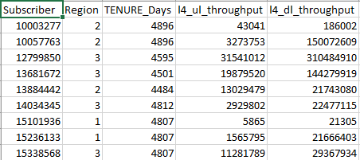
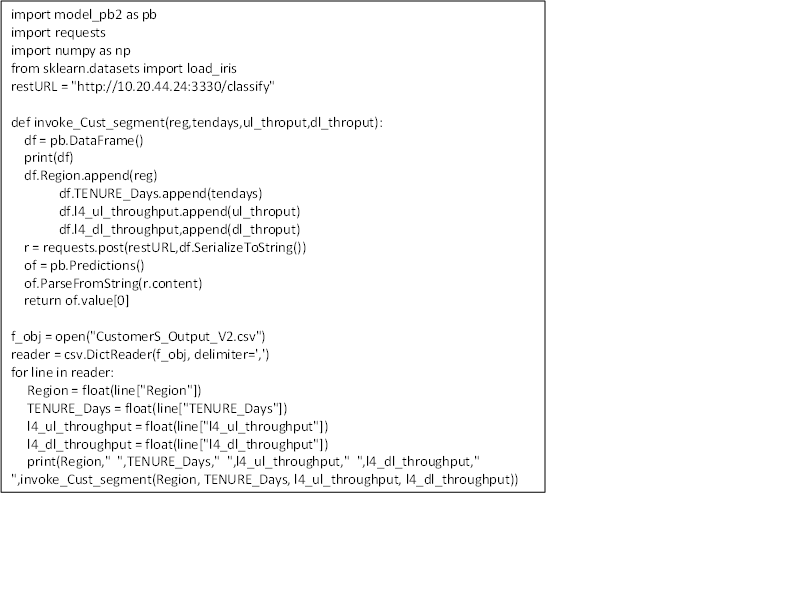

=============================
Digital Customer Segmentation
=============================

**Identifies key differentiators to divide customers into groups that can be targeted.**

Table of Contents
=================

`Customer: Telecom <#customer-telecom>`__

`Business Problem: <#business-problem>`__

`Business Requirement: <#business-requirement>`__

`Benefits: <#benefits>`__

`DATA used for the study: <#data-used-for-the-study>`__

`Data Fields Considered for the analysis: <#data-fields-considered-for-the-analysis>`__

`Machine Learning Algorithm Used: Kmeans Clustering <#machine-learning-algorithm-used-kmeans-clustering>`__

`Outcome:  <#outcome>`__

`Onboard the model, deploy and run the model <#onboard-the-model-deploy-and-run-the-model>`__

**Customer:** Telecom 
----------------------

**Business Problem:**
---------------------

-  Identify key differentiators that divide customers into groups that
   can be targeted using Information such as a customers' demographics
   like Bearer type, Browser used, Category of browsing, Region etc.,).

-  Marketing materials sent out using customer segmentation is more
   valued and appreciated.

**Business Requirement:**
-------------------------

-  Divide the customers into smaller groups with similar attributes.

-  Target the specific smaller groups to improve customer service and
   assist in customer loyalty and retention.

**Benefits:**
-------------

-  Personalized recommendation insights that are Suggestive around their
   needs.

-  Improve customer service and assist in customer loyalty and
   retention.

-  Provide deeper understanding of their customers' preferences and
   needs based on demographics.

**DATA used for the study:**
----------------------------

The dataset has 40000 records with 5 fields.

The sample data is shown below:

|image0|

**Data Fields Considered for the analysis:**
--------------------------------------------

-  Region - Customer place of recharge

-  TENURE_Days - how long customer associated with service provider

-  l4_ul_throughput - internet upload volume (kb's)

-  l4_dl_throughput - internet download volume (kb's)

**Machine Learning Algorithm Used: Kmeans Clustering**
------------------------------------------------------

-  Kmeans clustering method is used for customer segmentation.

-  Number of clusters considered are 4 based on the Elbow criteria.

**Outcome:**
-------------

Sample Output :

+-----------+-----------+-----------+-----------+-----------+-----------+
| Subscriber| Region    | TENURE_   | l4_ul_    | l4_dl_    | Predicted |
|           |           | Days      |throughput |throughput | Segment   |
+===========+===========+===========+===========+===========+===========+
| 19912682  | 3         | 1235      | 16534022  | 237360574 | 0         |
+-----------+-----------+-----------+-----------+-----------+-----------+
| 104061393 | 3         | 1900      | 1014474   | 8023971   | 0         |
+-----------+-----------+-----------+-----------+-----------+-----------+
| 125802926 | 3         | 1816      | 40799736  | 476783830 | 1         |
+-----------+-----------+-----------+-----------+-----------+-----------+
| 387108880 | 2         | 1876      | 74320606  | 934266794 | 1         |
+-----------+-----------+-----------+-----------+-----------+-----------+
| 403763030 | 3         | 1332      | 61568963  | 586627301 | 1         |
+-----------+-----------+-----------+-----------+-----------+-----------+
| 10003277  | 2         | 4896      | 43041     | 186002    | 2         |
+-----------+-----------+-----------+-----------+-----------+-----------+
| 10057763  | 2         | 4896      | 3273753   | 150072609 | 2         |
+-----------+-----------+-----------+-----------+-----------+-----------+
| 113602400 | 1         | 1756      | 5782436   | 75685429  | 3         |
+-----------+-----------+-----------+-----------+-----------+-----------+
| 115626313 | 1         | 1738      | 3093945   | 50925318  | 3         |
+-----------+-----------+-----------+-----------+-----------+-----------+
| 138211329 | 1         | 1704      | 4509669   | 27499257  | 3         |
+-----------+-----------+-----------+-----------+-----------+-----------+

-  Inputs - **Region, TENURE_Days, l4_ul_throughput, l4_dl_throughput**

-  Output - **Predicted Segment**

**Predicted Segment clusters description:**

+----------------+--------------------+
| Cluster Number | Cluster Name       |
+================+====================+
| 0              | Platinum Customers |
+----------------+--------------------+
| 1              | Gold Customers     |
+----------------+--------------------+
| 2              | Silver Customers   |
+----------------+--------------------+
| 3              | Diamond Customers  |
+----------------+--------------------+

**Onboard the model, deploy and run the model**
-----------------------------------------------

Steps to test the output for a model are -

Login to Acumos, Search for Model, deploy to cloud and run the script.

|image1|

The detailed document for onboarding, downloading and running the models is available on wiki @ https://wiki.acumos.org/display/AC/Soup-to-Nuts+Example:+Onboarding,+Downloading,+Deploying,+and+Using+a+Model+in+Acumos

**The deployed model can be run using below command -**

**1.      docker load  -i <Model docker image  >**

e.g. - docker load  -i   ~/Downloads/3330:3330 "your-server"--nexus01:8001/Customer_Segmentation _1_5_18_592f2cd4-9dbb-4a.tar

**2.     Docker run -p <external available port>:3330 <Model Docker imageI>**

e.g. - Docker run -p 3330:3330  "your-server"-nexus01:8001/Customer Segmentation_1_5_18_592f2cd4-9dbb-4a

**3.      Generate Model_pb2 script**

 This description file needs to be compiled into native code for your particular language (Python, in our case). We simply invoke the Protobuf compiler, instructing it to produce Python code in the current directory and need to rename python produced file name to model_pb2

$ protoc model.proto --python_out=.

The model microservice would be listening on the mentioned port. User
can use below script to invoke the model. The sample test data is
included below or user can try with different data in same format. User
should replace the restURL as per the deployment of the model.

**The script to execute the model mentioned below.**

**Script**:

|image2|

Note - model_pb2 as imported in script is compiled output of the model
proto file as mentioned in the wiki link mentioned above. This file
should be available along with the script file.

Sample Test data -

+-------+--------------+--------------+------------------+------------------+
| Index | Region       | TENURE_Days  | l4_ul_throughput | l4_dl_throughput |
+=======+==============+==============+==================+==================+
| 0     | -0.620809153 | 3.00400887   | -0.459748222     | -0.536581812     |
+-------+--------------+--------------+------------------+------------------+
| 1     | -0.620809153 | 3.00400887   | -0.334441139     | 0.218128239      |
+-------+--------------+--------------+------------------+------------------+
| 2     | 0.383167807  | 2.750716471  | 0.761938785      | 1.025837336      |
+-------+--------------+--------------+------------------+------------------+
| 3     | 0.383167807  | 2.67161519   | 0.309633674      | 0.188960848      |
+-------+--------------+--------------+------------------+------------------+
| 4     | -0.620809153 | 2.657309639  | 0.043946526      | -0.428037468     |
+-------+--------------+--------------+------------------+------------------+
| 5     | 0.383167807  | 2.933322619  | -0.347781696     | -0.42434145      |
+-------+--------------+--------------+------------------+------------------+
| 6     | -1.624786114 | 2.929115104  | -0.461190139     | -0.537411095     |
+-------+--------------+--------------+------------------+------------------+
| 7     | -1.624786114 | 2.929115104  | -0.400686362     | -0.428423552     |
+-------+--------------+--------------+------------------+------------------+
| 8     | 0.383167807  | 2.929115104  | -0.02383975      | -0.389644752     |
+-------+--------------+--------------+------------------+------------------+
| 9     | 0.383167807  | 2.929115104  | -0.02383975      | -0.281457691     |
+-------+--------------+--------------+------------------+------------------+
| 10    | 0.383167807  | 2.600928939  | -0.359131007     | -0.499345975     |
+-------+--------------+--------------+------------------+------------------+
| 11    | 0.383167807  | 2.559695293  | -0.279648865     | -0.387292519     |
+-------+--------------+--------------+------------------+------------------+
| 12    | 0.383167807  | 2.548755754  | -0.37524951      | -0.453619067     |
+-------+--------------+--------------+------------------+------------------+
| 13    | 0.383167807  | 2.515937137  | -0.391719106     | -0.464786335     |
+-------+--------------+--------------+------------------+------------------+
| 14    | 0.383167807  | -0.076733565 | 0.179874477      | 0.657641188      |
+-------+--------------+--------------+------------------+------------------+
| 15    | -1.624786114 | 2.504997599  | -0.315701774     | -0.3767865       |
+-------+--------------+--------------+------------------+------------------+
| 16    | -0.620809153 | 2.504997599  | -0.440543423     | -0.530685142     |
+-------+--------------+--------------+------------------+------------------+
| 17    | 0.383167807  | 2.464605455  | 0.079412096      | -0.219282928     |
+-------+--------------+--------------+------------------+------------------+
| 18    | 0.383167807  | 2.312293415  | -0.326135421     | -0.37528408      |
+-------+--------------+--------------+------------------+------------------+

The output will be seen as predicted output 0,1,2,3.

**Test Output:**

+-----------+-----------+-----------+-----------+-----------+-----------+
| Index     | Region    | TENURE_Da | l4_ul_thr | l4_dl_thr | Predicted |
|           |           | ys        | oughput   | oughput   | Segmented |
+===========+===========+===========+===========+===========+===========+
| 0         | -0.620809 | 3.0040088 | -0.459748 | -0.536581 | 2         |
|           | 153       | 7         | 222       | 812       |           |
+-----------+-----------+-----------+-----------+-----------+-----------+
| 1         | -0.620809 | 3.0040088 | -0.334441 | 0.2181282 | 2         |
|           | 153       | 7         | 139       | 39        |           |
+-----------+-----------+-----------+-----------+-----------+-----------+
| 2         | 0.3831678 | 2.7507164 | 0.7619387 | 1.0258373 | 2         |
|           | 07        | 71        | 85        | 36        |           |
+-----------+-----------+-----------+-----------+-----------+-----------+
| 3         | 0.3831678 | 2.6716151 | 0.3096336 | 0.1889608 | 2         |
|           | 07        | 9         | 74        | 48        |           |
+-----------+-----------+-----------+-----------+-----------+-----------+
| 4         | -0.620809 | 2.6573096 | 0.0439465 | -0.428037 | 2         |
|           | 153       | 39        | 26        | 468       |           |
+-----------+-----------+-----------+-----------+-----------+-----------+
| 5         | 0.3831678 | 2.9333226 | -0.347781 | -0.424341 | 2         |
|           | 07        | 19        | 696       | 45        |           |
+-----------+-----------+-----------+-----------+-----------+-----------+
| 6         | -1.624786 | 2.9291151 | -0.461190 | -0.537411 | 2         |
|           | 114       | 04        | 139       | 095       |           |
+-----------+-----------+-----------+-----------+-----------+-----------+
| 7         | -1.624786 | 2.9291151 | -0.400686 | -0.428423 | 2         |
|           | 114       | 04        | 362       | 552       |           |
+-----------+-----------+-----------+-----------+-----------+-----------+
| 8         | 0.3831678 | 2.9291151 | -0.023839 | -0.389644 | 2         |
|           | 07        | 04        | 75        | 752       |           |
+-----------+-----------+-----------+-----------+-----------+-----------+
| 9         | 0.3831678 | 2.9291151 | -0.023839 | -0.281457 | 2         |
|           | 07        | 04        | 75        | 691       |           |
+-----------+-----------+-----------+-----------+-----------+-----------+
| 10        | 0.3831678 | 2.6009289 | -0.359131 | -0.499345 | 2         |
|           | 07        | 39        | 007       | 975       |           |
+-----------+-----------+-----------+-----------+-----------+-----------+
| 11        | 0.3831678 | 2.5596952 | -0.279648 | -0.387292 | 2         |
|           | 07        | 93        | 865       | 519       |           |
+-----------+-----------+-----------+-----------+-----------+-----------+
| 12        | 0.3831678 | 2.5487557 | -0.375249 | -0.453619 | 2         |
|           | 07        | 54        | 51        | 067       |           |
+-----------+-----------+-----------+-----------+-----------+-----------+
| 13        | 0.3831678 | 2.5159371 | -0.391719 | -0.464786 | 2         |
|           | 07        | 37        | 106       | 335       |           |
+-----------+-----------+-----------+-----------+-----------+-----------+
| 14        | 0.3831678 | -0.076733 | 0.1798744 | 0.6576411 | 0         |
|           | 07        | 565       | 77        | 88        |           |
+-----------+-----------+-----------+-----------+-----------+-----------+
| 15        | -1.624786 | 2.5049975 | -0.315701 | -0.376786 | 2         |
|           | 114       | 99        | 774       | 5         |           |
+-----------+-----------+-----------+-----------+-----------+-----------+
| 16        | -0.620809 | 2.5049975 | -0.440543 | -0.530685 | 2         |
|           | 153       | 99        | 423       | 142       |           |
+-----------+-----------+-----------+-----------+-----------+-----------+
| 17        | 0.3831678 | 2.4646054 | 0.0794120 | -0.219282 | 2         |
|           | 07        | 55        | 96        | 928       |           |
+-----------+-----------+-----------+-----------+-----------+-----------+
| 18        | 0.3831678 | 2.3122934 | -0.326135 | -0.375284 | 2         |
|           | 07        | 15        | 421       | 08        |           |
+-----------+-----------+-----------+-----------+-----------+-----------+
| 19        | 0.3831678 | 2.2399241 | 0.1087882 | 0.1520370 | 2         |
|           | 07        | 58        | 31        | 32        |           |
+-----------+-----------+-----------+-----------+-----------+-----------+

.. |image1| image:: media/Dimage1.png

